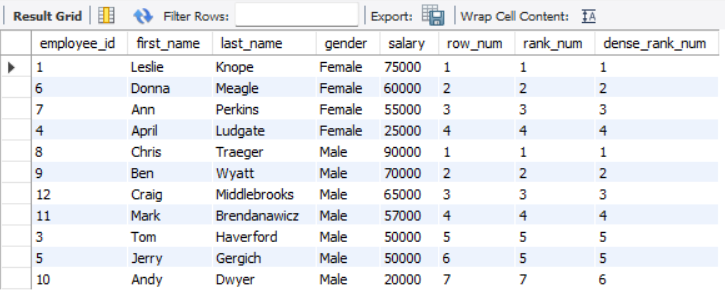
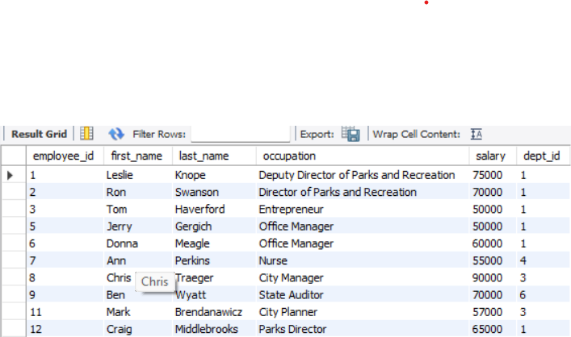

# SQL Portfolio – Kathryn Starkey

This repository showcases a variety of SQL queries I’ve written and executed while practicing with datasets.  
It demonstrates core SQL skills including filtering, joins, aggregation, subqueries, window functions, CTEs, and more.

For each example, you’ll see:  
- **The business-style question/problem**  
- **The SQL query I wrote**  
- **A screenshot of the result**  

---

## 🔹 1. Basic Filtering & Sorting  

**Question:** Show all employees born before 1985 who are male.  
```sql
SELECT * 
FROM employee_demographics
WHERE birth_date < '1985-01-01'
  AND gender = 'Male';
```
Result Screenshot:  


**Question:** List employees ordered first by gender, then by age descending.
```sql
SELECT *
FROM employee_demographics
ORDER BY gender, age DESC;
```
Result Screenshot:  


---

## 🔹 2. Aggregations & Grouping

**Question:** What is the average, maximum, and minimum age of employees by gender?
```sql
SELECT gender, AVG(age), MAX(age), MIN(age), COUNT(age)
FROM employee_demographics
GROUP BY gender;
```
Result Screenshot:  


**Question:** Which gender has an average age greater than 40?
```sql
SELECT gender, AVG(age) AS avg_age
FROM employee_demographics
GROUP BY gender
HAVING AVG(age) > 40;
```
Result Screenshot:  


---

## 🔹 3. Joins

**Question:** Show each employee’s age and occupation by joining demographics with salary data.
```sql
SELECT dem.employee_id, dem.age, sal.occupation
FROM employee_demographics AS dem
INNER JOIN employee_salary AS sal
    ON dem.employee_id = sal.employee_id;
```
Result Screenshot:  


**Question:** List all salary records, even if the employee has no demographic data (RIGHT JOIN).
```sql
SELECT *
FROM employee_demographics AS dem
RIGHT JOIN employee_salary AS sal
    ON dem.employee_id = sal.employee_id;
```
Result Screenshot:  


**Question:** Pair each employee with the next employee in the salary table (self-join).
```sql
SELECT emp1.employee_id AS emp_santa,
       emp1.first_name AS first_name_santa,
       emp2.employee_id AS emp_name,
       emp2.first_name AS first_name_emp
FROM employee_salary emp1
JOIN employee_salary emp2
    ON emp1.employee_id + 1 = emp2.employee_id;
```
Result Screenshot:  


---

## 🔹 4. Set Operations

**Question:** Create a unified list of employees over 40 (male/female) and employees earning more than $70,000.
```sql
SELECT first_name, last_name, 'Old Man' AS Label
FROM employee_demographics
WHERE age > 40 AND gender = 'Male'
UNION
SELECT first_name, last_name, 'Old Lady' AS Label
FROM employee_demographics
WHERE age > 40 AND gender = 'Female'
UNION
SELECT first_name, last_name, 'Highly Paid Employee' AS Label
FROM employee_salary
WHERE salary > 70000
ORDER BY first_name, last_name;
```
Result Screenshot:  


---

## 🔹 5. String & Date Functions

**Question:** Display each employee’s first name along with string manipulations and birth month.
```sql
SELECT first_name, 
       LEFT(first_name, 4) AS first_four_letters,
       RIGHT(first_name, 4) AS last_four_letters,
       SUBSTRING(first_name, 3, 2) AS middle_two_letters,
       birth_date,
       SUBSTRING(birth_date, 6, 2) AS birth_month
FROM employee_demographics;
```
Result Screenshot:  


---

## 🔹 6. Case Statements

**Question:** Calculate new salaries with raises and add bonuses for Finance employees.
```sql
SELECT first_name, last_name, salary,
       CASE
           WHEN salary < 50000 THEN salary * 1.05
           WHEN salary >= 50000 THEN salary * 1.07
       END AS new_salary,
       CASE
           WHEN dept_id = 6 THEN salary * 0.10
       END AS bonus
FROM employee_salary;
```
Result Screenshot:  


---

## 🔹 7. Subqueries

**Question:** What is the average of the maximum ages across genders?
```sql
SELECT AVG(max_age) 
FROM (
    SELECT gender, MAX(age) AS max_age
    FROM employee_demographics
    GROUP BY gender
) AS Agg_table;
```
Result Screenshot:  


---

## 🔹 8. Window Functions

**Question:** Calculate a running total of salaries within each gender, ordered by employee ID.
```sql
SELECT dem.first_name, dem.last_name, gender, salary,
       SUM(salary) OVER(PARTITION BY gender ORDER BY dem.employee_id) AS rolling_total
FROM employee_demographics dem
JOIN employee_salary sal
    ON dem.employee_id = sal.employee_id;
```
Result Screenshot:  


**Question:** Rank employees within each gender by salary (row number, rank, dense rank).
```sql
SELECT dem.employee_id, dem.first_name, dem.last_name, gender, salary,
       ROW_NUMBER() OVER(PARTITION BY gender ORDER BY salary DESC) AS row_num,
       RANK() OVER(PARTITION BY gender ORDER BY salary DESC) AS rank_num,
       DENSE_RANK() OVER(PARTITION BY gender ORDER BY salary DESC) AS dense_rank_num
FROM employee_demographics dem
JOIN employee_salary sal
    ON dem.employee_id = sal.employee_id;
```
Result Screenshot:  


---

## 🔹 9. CTEs

**Question:** Create a CTE summarizing salary statistics by gender, then query it.
```sql
WITH CTE_Example AS (
    SELECT gender, AVG(salary) AS avg_sal, MAX(salary) AS max_sal, MIN(salary) AS min_sal, COUNT(salary) AS count_sal
    FROM employee_demographics dem
    JOIN employee_salary sal
        ON dem.employee_id = sal.employee_id
    GROUP BY gender
)
SELECT *
FROM CTE_Example;
```
Result Screenshot:  


---

## 🔹 10. Temporary Tables

**Question:** Create a temporary table for employees earning at least $50,000, then query it.
```sql
CREATE TEMPORARY TABLE salary_over_50k AS
SELECT * 
FROM employee_salary 
WHERE salary >= 50000;

SELECT *
FROM salary_over_50k;
```
Result Screenshot:  


---

## 📂 Dataset Credit
Practice dataset "parks_and_rec_create_db.sql courtesy of Alex the Analylist. Used for SQL learning purposes.
