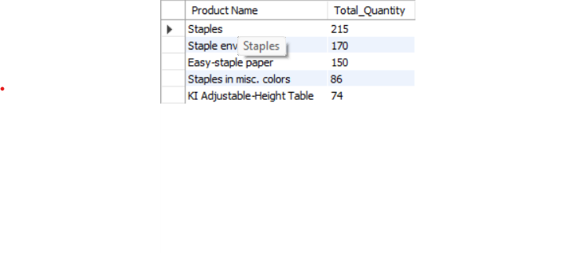

# SQL Portfolio – Kathryn Starkey  
## Sales (Superstore) Dataset  

The Superstore Sales dataset is a retail dataset widely used in analytics practice. This project demonstrates how I use SQL to answer real-world business questions such as sales trends, profitability by category, and customer segmentation. By applying filtering, aggregations, subqueries, date functions, and window functions, I show the ability to transform raw transactional data into insights. These are the same skills that support monitoring and troubleshooting in a data warehouse environment, where performance, accuracy, and timely insights are critical.
 
For each example, you’ll see:

- **The business-style question/problem**  
- **The SQL query I wrote**  
- **A screenshot of the result**  

---

## 1. Basic Filtering and Sorting  

**Question:** What are the top 10 Customers by Total Sales?  
```sql
SELECT `Customer Name`, SUM(Sales) AS Total_Sales
FROM superstore.orders
GROUP BY `Customer Name`
ORDER BY Total_Sales DESC
LIMIT 10;
```

**Result Screenshot:**


## 2. Aggregation
   
**Question:** What is the total profit by product category?
```sql
SELECT Category, SUM(Profit) AS Total_Profit
FROM superstore.orders
GROUP BY Category
ORDER BY Total_Profit DESC;
```

**Result Screenshot:**


## 3. Date Functions

**Question:** What is the Monthly Sales Trend?
```sql
SELECT DATE_FORMAT(`Order Date`, '%Y-%m') AS Month,
        SUM(Sales) AS Monthly_Sales
FROM superstore.orders
GROUP BY Month 
ORDER BY Month;
```
**Result Screenshot:**


## 4. Subquery
**Question:** What are the Top 5 Products by Quantity sold?
```sql
SELECT Product_Name, Total_Quantity
FROM (
    SELECT `Product Name` AS Product_Name,
           SUM(Quantity) AS Total_Quantity,
           ROW_NUMBER() OVER (ORDER BY SUM(Quantity) DESC) AS rn
    FROM superstore.orders
    GROUP BY `Product Name`
) ranked
WHERE rn <= 5;
```

**Result Screenshot:**


## 5. Aggregation with Grouping

**Question:** What Regions have negative profit?
```sql
SELECT Region, SUM(Profit) AS Total_Profit
FROM superstore.orders
GROUP BY Region
HAVING Total_Profit < 0
ORDER BY  Total_Profit ASC;
```

**Result Screenshot:**


## 6. Window Function (ROW_NUMBER)

**Question:** Who are the top 3 customers by total sales in each region?
```sql
WITH Customer_Sales AS (
    SELECT 
        Region,
        `Customer Name` AS Customer_Name,
        SUM(Sales) AS Total_Sales
    FROM orders
    GROUP BY Region, `Customer Name`
)
SELECT Region, Customer_Name, Total_Sales
FROM (
    SELECT 
        Region,
        Customer_Name,
        Total_Sales,
        ROW_NUMBER() OVER (PARTITION BY Region ORDER BY Total_Sales DESC) AS rn
    FROM Customer_Sales
) ranked
WHERE rn <= 3
ORDER BY Region, rn;
```

**Result Screenshot:**

