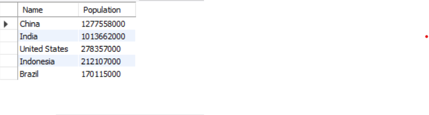
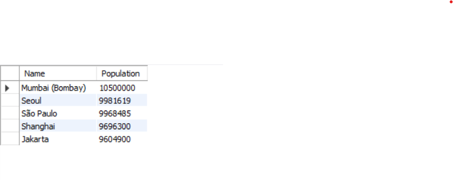
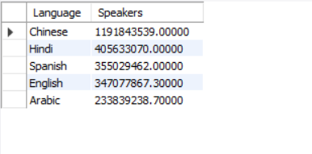
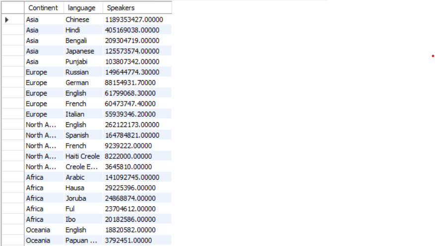
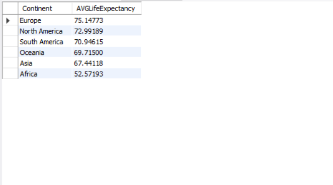
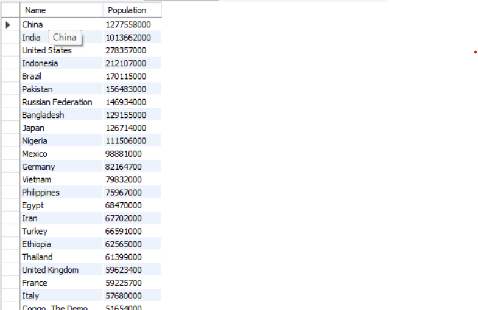
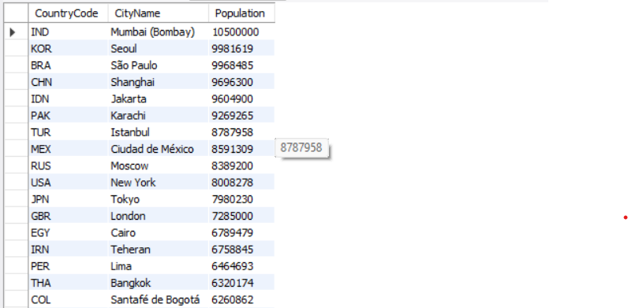

# SQL Portfolio – Kathryn Starkey
## World Dataset

This section of my portfolio showcases a variety of SQL queries written and executed on the **World** dataset.  
It demonstrates core SQL skills including filtering, joins, aggregation, window functions, and subqueries.

For each example, you’ll see:  
- **The business-style question/problem**  
- **The SQL query I wrote**  
- **A screenshot of the result** 
--- 

## 1. Basic Filtering and Sorting

**Question:**  What are the top 5 most populous countries?
``` sql
SELECT Name, Population
FROM country
ORDER BY Population DESC
LIMIT 5;
```

**Result Screenshot:**


**Question:**  What are the top 5 most populous cities?
``` sql
SELECT Name, Population
FROM city
ORDER BY Population DESC
LIMIT 5;
```

**Result Screenshot:**


**Question:** What are the top 5 spoken languages?
``` sql
SELECT Language, SUM(Population * Percentage / 100) AS Speakers
FROM countrylanguage cl
JOIN country c ON cl.CountryCode = c.Code
GROUP BY Language
ORDER BY Speakers DESC
LIMIT 5;
```

**Result Screenshot:**


## 2. Window Functions (ROW_NUMBER) with Joins & Aggregation

**Question:**  What are the top 5 Languages per continent?
``` sql
WITH language_counts AS (
	SELECT 
		c.Continent,
        cl.language,
        SUM(C.Population * cl.Percentage/100) AS Speakers
        FROM countrylanguage cl
        JOIN country c ON cl.CountryCode = c.Code 
        GROUP BY c.Continent, cl.Language
        )
SELECT Continent, language, Speakers
FROM(
	SELECT 
		Continent, Language, Speakers,
        ROW_NUMBER() OVER (PARTITION BY Continent ORDER BY Speakers DESC) AS rn
	FROM language_counts
)ranked
WHERE rn <= 5
ORDER BY Continent, rn;
```

**Result Screenshot:**


**Question:** What are the top 5 Languages per region?
``` sql
WITH language_counts AS (
	SELECT
		c.Region,
        cl.Language,
        SUM(c.Population * cl.Percentage/100) AS Speakers
	FROM countrylanguage cl
    JOIN country c ON cl.CountryCode = c.Code
    GROUP BY c.Region, cl.Language
)
SELECT Region, Language, Speakers
FROM (
	SELECT
		Region, Language, Speakers,
        ROW_NUMBER() OVER (PARTITION BY Region ORDER BY Speakers DESC) AS rn
	FROM language_counts
)ranked
WHERE rn <= 5
ORDER BY Region, rn;
```

**Result Screenshot:**


## 3. Simple Aggregation

**Question:** What is the average life expectancy by continent?
``` sql
SELECT Continent, AVG(LifeExpectancy) AS AVGLifeExpectancy
FROM country
WHERE LifeExpectancy IS NOT NULL
GROUP BY Continent
ORDER BY AvgLifeExpectancy DESC;
```

**Result Screenshot:**


## 4. Using Subqueries in WHERE

**Question:** List the countries with a population greater than the average population.
``` sql
SELECT Name, Population
FROM country
WHERE Population > (
	SELECT AVG(Population) FROM country
)
ORDER BY Population DESC;
```

**Result Screenshot:**


## 5. Classic Window Function with ROW_NUMBER

**Question:** Find the city with the largest population in each country.
``` sql
SELECT CountryCode, Name AS CityName, Population
FROM (
	SELECT 	
		CountryCode, Name, Population,
        ROW_NUMBER() OVER (PARTITION BY CountryCode ORDER BY Population DESC) AS rn
	FROM city
)ranked
WHERE rn = 1
ORDER BY Population DESC;
```

**Result Screenshot:**

